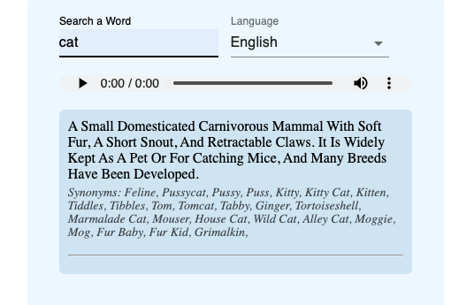

***Dictionary App***
* [JSX](https://www.w3schools.com/react/react_jsx.asp) used for templating.
* [React](https://tr.reactjs.org/) and [Material UI](https://material-ui.com/getting-started/templates/) are used for UI.

